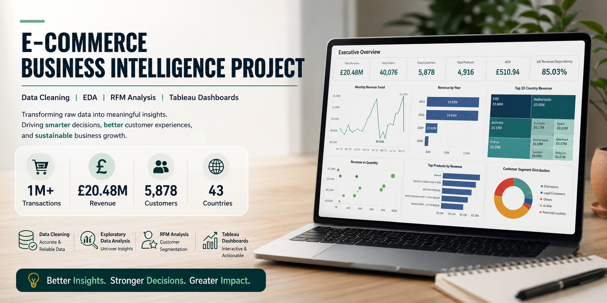
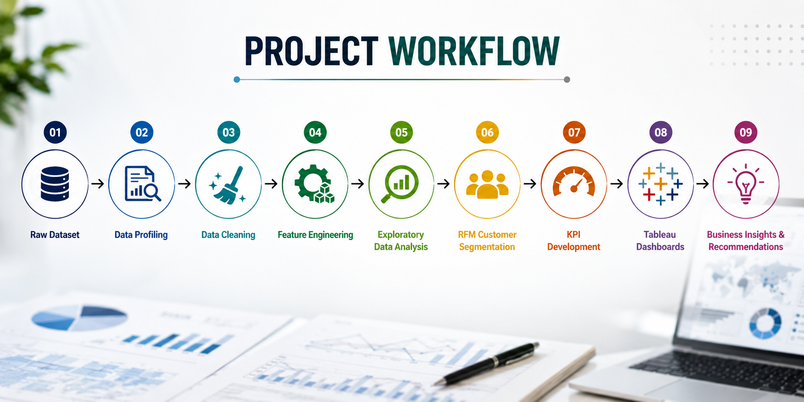
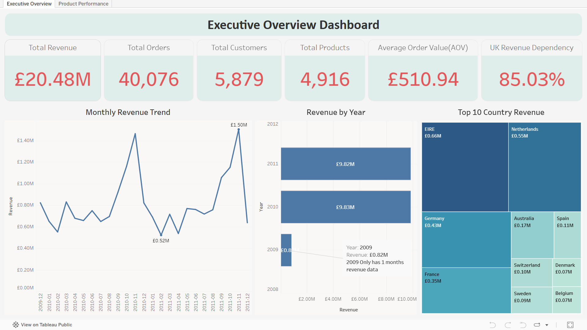
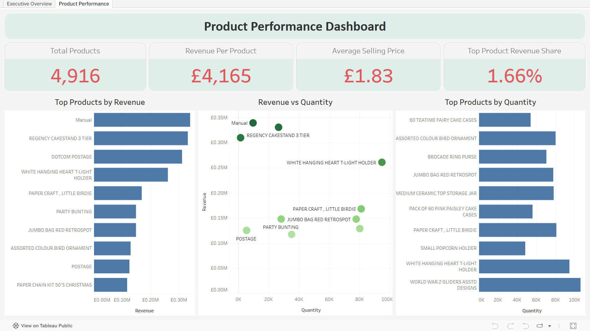
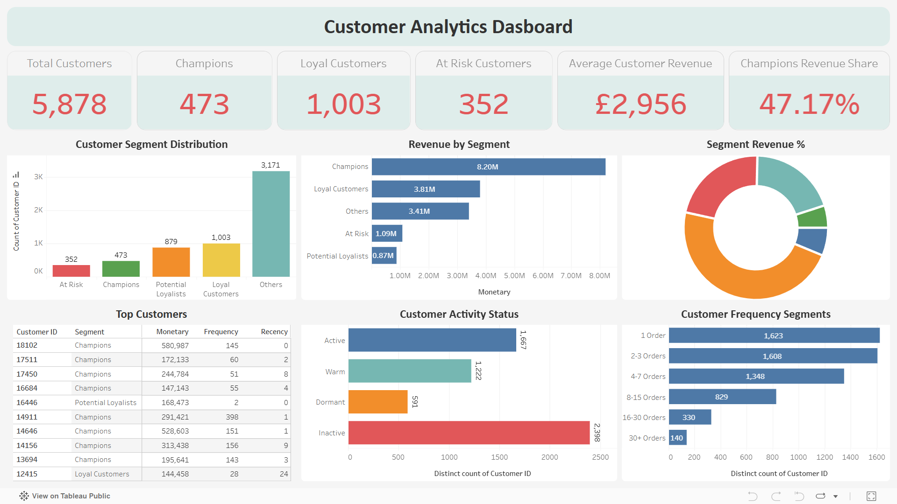

---
# 📌 Project Overview

Modern e-commerce businesses generate massive volumes of transactional data every day. However, raw business data often contains missing values, duplicate records, cancelled transactions, invalid entries, and inconsistencies that reduce reporting accuracy and hinder effective decision-making.

This project demonstrates a complete Business Intelligence workflow by transforming raw e-commerce transaction data into actionable insights through

- Data Cleaning

- Exploratory Data Analysis (EDA)

- KPI Development

- Customer Segmentation (RFM)

- Business Reporting

- Interactive Tableau Dashboards

The objective was to convert over **1 million raw transaction records** into a reliable analytical dataset capable of supporting business decisions related to sales performance, customer retention, product strategy, and market expansion.

---

# 🎯 Business Problem

Organizations frequently collect large amounts of customer and sales data but struggle to extract meaningful insights due to poor data quality and fragmented reporting systems.

This project addresses the following challenges:

* Missing customer information
* Duplicate transaction records
* Cancelled and invalid transactions
* Inconsistent reporting metrics
* Lack of customer segmentation
* Limited visibility into product and market performance

The solution involved building a complete analytics pipeline that cleans, analyzes, segments, and visualizes e-commerce transaction data.

---

# 📊 Dataset Overview

The project utilizes the **Online Retail II Dataset**, containing transactional data from a UK-based online retailer between **December 2009 and December 2011**.

| Metric              | Value               |
| ------------------- | ------------------- |
| Original Records    | 1,067,371           |
| Final Clean Records | 1,007,913           |
| Customers Analyzed  | 5,878               |
| Products Analyzed   | 4,916               |
| Countries           | 43                  |
| Time Period         | Dec 2009 – Dec 2011 |
| Total Revenue       | £20.48 Million      |
| Total Orders        | 40,076              |
| Average Order Value | £510.94             |

---

# 🛠️ Tools & Technologies

| Category           | Tools              |
| ------------------ | ------------------ |
| Programming        | Python             |
| Data Processing    | Pandas, NumPy      |
| Analysis           | Jupyter Notebook   |
| Visualization      | Tableau Public     |
| Reporting          | Tableau Dashboards |
| Customer Analytics | RFM Segmentation   |
| Version Control    | Git & GitHub       |

---

# 🔄 Project Workflow


---

# 🧹 Data Cleaning Summary

The initial dataset contained several data quality issues that could negatively impact business reporting.

| Data Quality Issue   | Records |
| -------------------- | ------- |
| Missing Customer IDs | 243,007 |
| Missing Descriptions | 4,382   |
| Duplicate Records    | 34,335  |
| Cancelled Orders     | 19,494  |
| Negative Quantities  | 22,950  |
| Invalid Prices       | 6,207   |

### Cleaning Actions Performed

* Removed duplicate transactions
* Identified cancelled orders
* Classified inventory adjustment records
* Removed invalid sales transactions
* Standardised date formats
* Created revenue calculations
* Generated analytical features
* Prepared final reporting dataset

---

# 📈 Key Business KPIs

| KPI                          | Value   |
| ---------------------------- | ------- |
| Total Revenue                | £20.48M |
| Total Orders                 | 40,076  |
| Total Customers              | 5,878   |
| Total Products               | 4,916   |
| Average Order Value          | £510.94 |
| Countries Served             | 43      |
| UK Revenue Share             | 85.03%  |
| Champions Revenue Share      | 47.17%  |
| Top 10 Product Revenue Share | 10.15%  |

---

# 👥 Customer Segmentation (RFM Analysis)

One of the key objectives of this project was to identify high-value customers using the RFM (Recency, Frequency, Monetary) framework.

RFM segmentation evaluates customers based on:

### Recency (R)

How recently a customer made a purchase.

### Frequency (F)

How often a customer purchases.

### Monetary (M)

How much revenue a customer generates.

---

## Customer Segment Distribution

| Segment             | Customers |
| ------------------- | --------- |
| Champions           | 473       |
| Loyal Customers     | 1,003     |
| Potential Loyalists | 879       |
| At Risk             | 352       |
| Others              | 3,171     |

---

## Revenue Contribution by Segment

| Segment             | Revenue Share |
| ------------------- | ------------- |
| Champions           | 47.17%        |
| Loyal Customers     | 21.90%        |
| Others              | 19.65%        |
| At Risk             | 6.27%         |
| Potential Loyalists | 5.01%         |

### Key Insight

Although Champion Customers represent a relatively small portion of the customer base, they contribute nearly half of total customer-attributable revenue, making customer retention a critical business priority.

---

# 📊 Tableau Dashboard Showcase

## Executive Overview Dashboard

<a href="https://public.tableau.com/views/E-CommerceExecutiveProductPerformanceDashboard/Dashboard1">
  
</a>

### Dashboard Highlights

* Revenue Overview
* Monthly Revenue Trend
* Revenue by Year
* Country Revenue Distribution
* UK Revenue Dependency Analysis
* Executive KPI Monitoring

<a href="https://public.tableau.com/views/E-CommerceExecutiveProductPerformanceDashboard/Dashboard1">
🔗 Click Here for Live Dashboard</a>

---

## Product Performance Dashboard

<a href="https://public.tableau.com/views/E-CommerceExecutiveProductPerformanceDashboard/Dashboard2">
  
</a>

### Dashboard Highlights

* Product Revenue Analysis
* Product Quantity Analysis
* Revenue vs Quantity Comparison
* Product Contribution Analysis
* Average Selling Price Metrics

<a href="https://public.tableau.com/views/E-CommerceExecutiveProductPerformanceDashboard/Dashboard2">
🔗 Click Here for Live Dashboard</a>

---

## Customer Analytics Dashboard

<a href="https://public.tableau.com/views/E-CommerceCustomerRFMAnalysisMajorProject/Dashboard1">
  
</a>

### Dashboard Highlights

* RFM Segmentation
* Customer Activity Analysis
* Revenue by Segment
* Customer Frequency Analysis
* Top Customer Identification

<a href="https://public.tableau.com/views/E-CommerceCustomerRFMAnalysisMajorProject/Dashboard1">
🔗 Click Here for Live Dashboard</a>

---

# 🔍 Key Insights & Findings

### Revenue Performance

* Generated £20.48M in total revenue.
* Processed 40,076 completed orders.
* Average Order Value reached £510.94.

### Geographic Analysis

* United Kingdom contributed 85.03% of revenue.
* Revenue generated from 43 countries.
* Significant opportunity exists for international expansion.

### Product Analysis

* Top 10 products contribute only 10.15% of total revenue.
* Revenue is distributed across a diversified product portfolio.
* Business is not overly dependent on a single product.

### Customer Analysis

* Champions contribute 47.17% of revenue.
* Loyal customers contribute 21.90%.
* Customer retention initiatives could significantly impact business growth.

---

# 📂 Repository Structure

```text
ecommerce-business-intelligence-project/

├── data/
├── codebase/
├── dashboards/
├── docs/
├── reports/
├── images/
├── README.md
└── LICENSE
```

---

# 📄 Project Report

The complete project documentation, methodology, analysis, findings, and recommendations are available in:

```text
reports/Final_Project_Report.pdf
```

---

# 👨‍💻 Author

### Sarath Kumar

BCA | Data Analytics Specialisation

Skills:

* Data Analytics
* Python
* SQL
* Tableau
* Business Intelligence
* Customer Analytics
* Dashboard Development

---

## ⭐ If you found this project useful, consider giving the repository a star.
